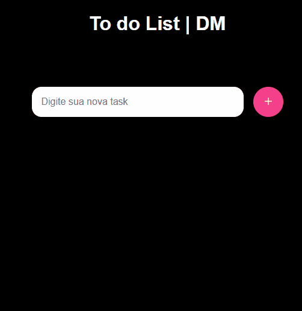

# 📝 To-Do List

Uma aplicação simples e intuitiva para gerenciamento de tarefas, desenvolvida com **HTML**, **CSS** e **JavaScript puro**, utilizando **Local Storage** para salvar os dados diretamente no navegador.

---

## 🚀 Funcionalidades

✅ Adicionar novas tarefas

✅ Impedir tarefas vazias

✅ Evitar tarefas duplicadas

✅ Remover tarefas concluídas

✅ Salvar tarefas automaticamente no navegador

✅ Interface simples e responsiva

---

## 🛠️ Tecnologias Utilizadas

* 🌐 HTML5
* 🎨 CSS3
* ⚡ JavaScript (Vanilla JS)
* 💾 Local Storage API

---

## 📂 Estrutura do Projeto

```text
to-do-list-js/
│
├── index.html
├── style.css
├── script.js
├── README.md
└── assets/
    └── preview.png
```

## 💡 Conceitos Praticados

Durante o desenvolvimento deste projeto foram utilizados conceitos importantes de JavaScript:

* Manipulação do DOM
* Eventos
* Arrays
* Métodos `find()` e `findIndex()`
* Template Literals
* Local Storage
* Estruturas condicionais
* Funções

---

## 📸 Preview

Adicione uma captura de tela do projeto na pasta `assets` e exiba aqui:

```md

```

---

## 🎯 Próximas Melhorias

* [ ] Editar tarefas
* [ ] Marcar tarefas como concluídas
* [ ] Filtros (Todas, Pendentes e Concluídas)
* [ ] Modo Dark/Light
* [ ] Responsividade para dispositivos móveis
* [ ] Deploy online

---

## 📚 Aprendizado

Este projeto foi desenvolvido com o objetivo de praticar conceitos fundamentais de desenvolvimento Front-End e JavaScript puro, sem utilização de frameworks.

---

## 👩‍💻 Autora

Desenvolvido por **Eduarda Molina** 🚀

